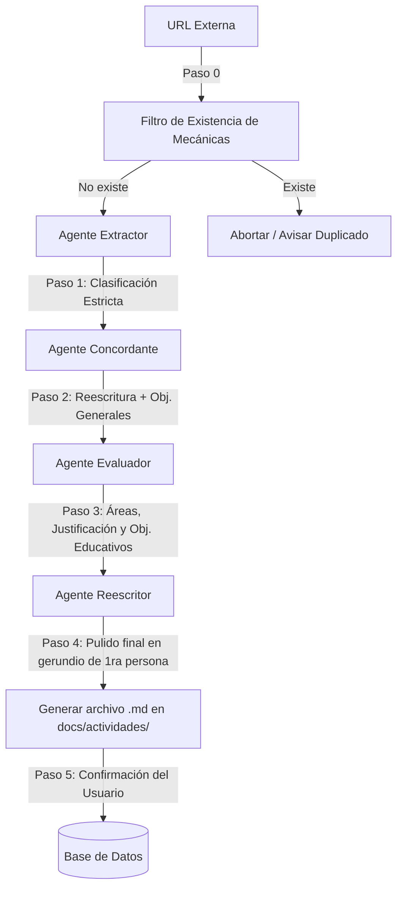

# Ciclo de Búsqueda de Actividades

Este documento define el protocolo y proceso estándar llamado **"Ciclo de búsqueda de actividades"** para el repositorio de NuaMana. Debe ejecutarse rigurosamente cada vez que el usuario solicite añadir dinámicas externas al sistema.

---

## 🔄 Fases del Ciclo de Búsqueda



---

## 📝 Protocolo Paso a Paso

### Paso 0: Filtro de Existencia (Prevención de Duplicados)
Antes de llamar a cualquier agente, se debe validar que la actividad no exista en la aplicación.
*   **Criterio de Validación:** No se debe validar solo por título. Se debe revisar el contenido y las **mecánicas clave de la descripción** (ej: buscar palabras clave como `"pelota que gira"`, `"jarras con agua"`, etc.) comparándolas contra la tabla `public.articulos` de la base de datos de producción o local.
*   **Acción si existe:** Si se encuentra una actividad similar, el ciclo se aborta y se notifica al usuario indicando el título de la actividad duplicada existente.

### Paso 1: Extracción y Clasificación (`activity_extractor`)
El Agente Extractor lee la URL externa y extrae los datos utilizando las taxonomías estrictas de NuaMana (Lugares jerárquicos, incrementos de duración y participantes exactos, y tipo de actividad).
*   *Especificación completa en:* [docs/activity-extractor-agent.md](file:///C:/Users/claud/Documents/PWA/NuaMana/docs/activity-extractor-agent.md)

### Paso 2: Reescritura y Objetivos Generales (`concordance_checker`)
El Agente Concordante toma la descripción original y **la reescribe por completo** con vocabulario scout para evitar plagio. Mapea la dinámica al catálogo oficial de 55 objetivos generales de la base de datos.
*   *Especificación completa en:* [docs/concordance-checker-agent.md](file:///C:/Users/claud/Documents/PWA/NuaMana/docs/concordance-checker-agent.md)

### Paso 3: Justificación Curricular (`evaluate-activities-objectives-agent`)
El Agente Evaluador audita el área de desarrollo, redacta la justificación metodológica de la selección de áreas, y vincula los objetivos educativos de la tabla `public.progresion_objetivos` garantizando cobertura total de los rangos de edad de la unidad elegida.
*   *Especificación completa en:* [docs/evaluate-activities-objectives-agent.md](file:///C:/Users/claud/Documents/PWA/NuaMana/docs/evaluate-activities-objectives-agent.md)

### Paso 4: Pulido Pedagógico y Gerundios (`pedagogical_rewriter`)
El Agente Reescritor Pedagógico revisa el `como_se_cumple` de cada objetivo educativo y lo reescribe con gerundios activos en primera persona comprensible por niños y jóvenes.
*   *Especificación completa en:* [docs/pedagogical-rewriter-instructions.md](file:///C:/Users/claud/Documents/PWA/NuaMana/docs/pedagogical-rewriter-instructions.md)

### Paso 5: Generación del Archivo Markdown (`docs/actividades/[slug].md`)
Al completarse el análisis de los agentes, los datos **no se insertan en la base de datos**. Se compila un archivo markdown estructurado en la carpeta del repositorio `docs/actividades/` con el siguiente formato:

```markdown
---
titulo: "Nombre de la Actividad Reescrita"
tipo: "juego | dinámica | juego nocturno | juego democrático"
duracion: "30 minutos"
cantidad: "08 participantes"
lugares: ["Interior", "sala"]
unidades: ["manada"]
areas_desarrollo: ["Sociabilidad"]
objetivos_generales: ["Trabajo en equipo"]
materiales: ["Lista de materiales"]
---

# [Nombre de la Actividad Reescrita]

## 📝 Descripción
[Descripción reescrita en tono scout]

## 🔄 Variaciones
[Variaciones de la actividad]

## ⚠️ Recomendaciones
[Recomendaciones de seguridad o ejecución]

## 🎯 Justificación Pedagógica de Áreas
[Justificación de la selección de áreas]

## 🎓 Objetivos Educativos y Evaluación (¿Cómo se cumple?)
| Unidad | Área | Objetivo Educativo | ¿Cómo se cumple? |
| :--- | :--- | :--- | :--- |
| Manada | Sociabilidad | [Texto Objetivo] | [Gerundio Activo de 1ra Persona] |
```

### Paso 6: Confirmación de Carga
El ciclo queda en pausa en este punto. Solo tras la **confirmación explícita del usuario**, se ejecuta la generación del SQL de inserción y se carga en la base de datos (local o producción).
